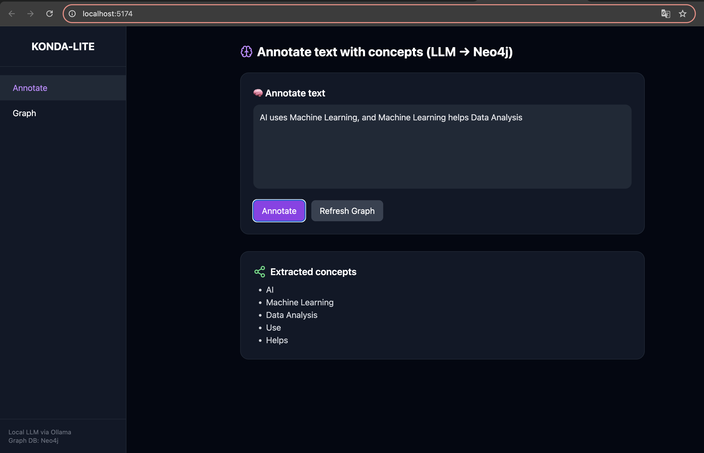

# 🧠 Pro_KONDA — Local AI Knowledge Graph Studio

**Transform raw text into an intelligent and interactive knowledge graph powered by Ollama + Neo4j + React.**



---

## 🚀 Overview

**Pro_KONDA** is a local AI application that automatically extracts key concepts from text, stores them in a **Neo4j graph database**, and displays them in an **interactive 3D visualization**.

The goal: transform textual knowledge into a usable semantic structure — directly on your computer, with no cloud dependencies.

---

## ⚙️ Main Features

✅ **Local LLM** — Uses [Ollama](https://ollama.ai) and models like `mistral` or `gemma` to analyze text.  
✅ **Graph Storage** — Concepts are automatically created and stored in **Neo4j**.  
✅ **3D Visualization** — Smooth navigation between nodes and relationships using D3.js.  
✅ **Modern Interface** — Reactive UI built with React + Tailwind + Framer Motion.  
✅ **100% Local & Private** — No data is ever sent outside your machine.  

---

## 🧱 Architecture
```
┌──────────────┐ ┌───────────────────┐ ┌────────────────────┐  
│ Frontend │────▶──│ Go Backend │────▶──│ Ollama + Neo4j    │  
│ (React + D3) │◀──────│ (REST API) │◀──────│ Local models  │  
└──────────────┘ └───────────────────┘ └────────────────────┘  
```
---

## 🧩 Technologies

| Component | Stack |
|------------|--------|
| **Frontend** | React, Vite, TailwindCSS, Framer Motion, D3.js |
| **Backend** | Go (net/http), Neo4j Go Driver |
| **Database** | Neo4j |
| **Local AI** | Ollama + Mistral or Gemma model |

---

## 📁 Project Structure
```
Pro_Konda/
├── backend/
│ ├── main.go # Go server + REST routes
│ ├── neo4j.go # Neo4j graph management
│ ├── ollama.go # Ollama model integration
│ └── go.mod
│
├── frontend/
│ ├── src/
│ │ ├── App.jsx
│ │ ├── GraphView3D.jsx
│ │ └── components/
│ └── package.json
│
└── docs/
└── screenshot.png
```

---

## ⚙️ Installation

### 1️⃣ Clone the repository
```
git clone https://github.com/<your-username>/Pro_KONDA.git
cd Pro_KONDA
```

### 2️⃣ Start Neo4j locally

Launch your Neo4j instance (Desktop or Docker):
```
bolt://localhost:7687
user: neo4j
pass: password
```

### 3️⃣ Start Ollama
```
ollama pull mistral
ollama serve
```

### 4️⃣ Run the backend
```
cd backend
go mod tidy
go run .
```

➡️ Open http://localhost:5174 in your browser

---

## 💡 Example Usage

Enter text in the “Annotate” interface, for example:

```
Artificial Intelligence studies how machines can learn and reason like humans.
```

Click **Annotate**

The LLM extracts the key concepts

Click **Graph** to visualize the 3D graph

---

## 🧠 Example Output

```
🔍 Annotating: Artificial Intelligence studies how machines can learn and reason like humans.
✅ Extracted concepts: [Artificial Intelligence, Machines, Learning, Reasoning, Humans]
💾 Saved to Neo4j successfully.
```

### Neo4j Query:
```
MATCH (a:Concept)-[r]->(b:Concept)
RETURN a,r,b;
```

---

## 🧩 Roadmap

- Full document processing  
- Automatic semantic links between concepts  
- Integrated chat with the knowledge graph  
- Export to JSON / GraphML  
- Docker Compose for the full stack  

---

## 🤝 Contributing

Pull requests are welcome!

- Fork the repository  
- Create a feature branch  
- Submit a pull request 🚀  

---

## 📜 License
```
MIT License © 2025 [Zakaria]
```
